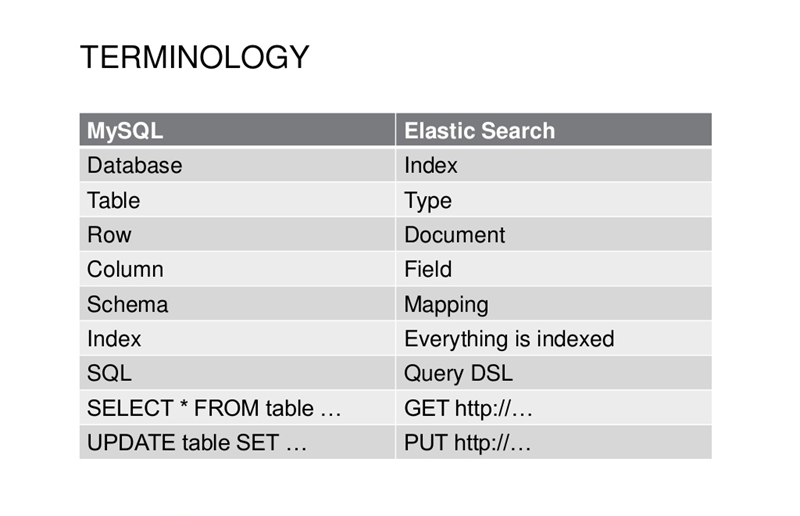

## 与 MYSQL 对比
   


---


### 索引一个文档

文档通过索引API被索引——存储并使其可搜索。但是最开始我们需要决定我们将文档存储在哪里。正如之前提到的，一篇文档通过_index, _type以及_id来确定它的唯一性。我们可以自己提供一个_id，或者也使用indexAPI 帮我们生成一个。
使用自己的ID

如果你的文档拥有天然的标示符（例如user_account字段或者文档中其他的标识值），这时你就可以提供你自己的_id，这样使用indexAPI：

```
PUT /{index}/{type}/{id}
{
  "field": "value",
  ...
}
```

举个例子。如果我们的索引叫做"website"，我们的类型叫做 "blog"，然后我们选择"123"作为ID的编号。这时，请求就是这样的：

```
PUT /website/blog/123
{
  "title": "My first blog entry",
  "text":  "Just trying this out...",
  "date":  "2014/01/01"
}
```

Elasticsearch返回内容：

```
{
   "_index":    "website",
   "_type":     "blog",
   "_id":       "123",
   "_version":  1,
   "created":   true
}
```

这个返回值意味着我们的索引请求已经被成功创建，其中还包含了_index, _type以及_id的元数据，以及一个新的元素_version。
在Elasticsearch中，每一个文档都有一个版本号码。每当文档产生变化时（包括删除），_version就会增大。在《版本控制》中，我们将会详细讲解如何使用_version的数字来确认你的程序不会随意替换掉不想覆盖的数据。

###自增ID

如果我们的数据中没有天然的标示符，我们可以让Elasticsearch为我们自动生成一个。请求的结构发生了变化：我们把PUT——“把文档存储在这个地址中”变量变成了POST——“把文档存储在这个地址下”。
这样一来，请求中就只包含 _index和_type了：
```
POST /website/blog/
{
  "title": "My second blog entry",
  "text":  "Still trying this out...",
  "date":  "2014/01/01"
}
```

这次的反馈和之前基本一样，只有_id改成了系统生成的自增值:
```
{
   "_index":    "website",
   "_type":     "blog",
   "_id":       "wM0OSFhDQXGZAWDf0-drSA",
   "_version":  1,
   "created":   true
}
```

自生成ID是由22个字母组成的，安全 universally unique identifiers 或者被称为UUIDs。


###创建新文档

当我们索引一个文档， 怎么确认我们正在创建一个完全新的文档，而不是覆盖现有的呢？

1. 确保创建一个新文档的最简单办法是，使用索引请求的 POST 形式让 Elasticsearch 自动生成唯一 _id

2. 然而，如果已经有自己的 _id ，那么我们必须告诉 Elasticsearch ，只有在相同的 _index 、 _type 和 _id 不存在时才接受我们的索引请求。这里有两种方式，他们做的实际是相同的事情。使用哪种，取决于哪种使用起来更方便。

- 第一种方法使用 op_type 查询 -字符串参数：
```
PUT /website/blog/123?op_type=create 
{ … }
```
- 第二种方法是在 URL 末端使用 /_create :
```
PUT /website/blog/123/_create 
{ … }
```

如果创建新文档的请求成功执行，Elasticsearch 会返回元数据和一个 201 Created 的 HTTP 响应码。

另一方面，如果具有相同的 _index 、 _type 和 _id 的文档已经存在，Elasticsearch 将会返回 409 Conflict 响应码，以及如下的错误信息：
```
{ 
“error”: { 
“root_cause”: [ 
{ 
“type”: “document_already_exists_exception”, 
“reason”: “[blog][123]: document already exists”, 
“shard”: “0”, 
“index”: “website” 
} 
], 
“type”: “document_already_exists_exception”, 
“reason”: “[blog][123]: document already exists”, 
“shard”: “0”, 
“index”: “website” 
}, 
“status”: 409 
}
```


###搜索文档
要从Elasticsearch中获取文档，我们需要使用同样的_index，_type以及 _id但是不同的HTTP变量GET：

```GET /website/blog/123?pretty```

返回结果包含了之前提到的内容，以及一个新的字段_source，它包含我们在最初创建索引时的原始JSON文档。
```
{
  "_index" :   "website",
  "_type" :    "blog",
  "_id" :      "123",
  "_version" : 1,
  "found" :    true,
  "_source" :  {
      "title": "My first blog entry",
      "text":  "Just trying this out..."
      "date":  "2014/01/01"
  }
}
```
---
pretty

在任意的查询字符串中添加pretty参数，类似上面的请求，Elasticsearch就可以得到优美打印的更加易于识别的JSON结果。_source字段不会执行优美打印，它的样子取决于我们录入的样子。

---
GET请求的返回结果中包含{"found": true}。这意味着这篇文档确实被找到了。如果我们请求了一个不存在的文档，我们依然会得到JSON反馈，只是found的值会变为false。
同样，HTTP返回码也会由'200 OK'变为'404 Not Found'。我们可以在curl后添加-i，这样你就能得到反馈头文件：

```curl -i -XGET /website/blog/124?pretty```

反馈结果就会是这个样子：

```
HTTP/1.1 404 Not Found
Content-Type: application/json; charset=UTF-8
Content-Length: 83

{
  "_index" : "website",
  "_type" :  "blog",
  "_id" :    "124",
  "found" :  false
}
```

检索文档中的一部分
通常，GET请求会将整个文档放入_source字段中一并返回。但是可能你只需要title字段。你可以使用_source得到指定字段。如果需要多个字段你可以使用逗号分隔：
```GET /website/blog/123?_source=title,text```

现在_source字段中就只会显示你指定的字段：
```
{
  "_index" :   "website",
  "_type" :    "blog",
  "_id" :      "123",
  "_version" : 1,
  "exists" :   true,
  "_source" : {
      "title": "My first blog entry" ,
      "text":  "Just trying this out..."
  }
}
```
或者你只想得到_source字段而不要其他的元数据，你可以这样请求：
```GET /website/blog/123/_source```

这样结果就只返回:
```
{
   "title": "My first blog entry",
   "text":  "Just trying this out...",
   "date":  "2014/01/01"
}
```

###检查文档是否存在

如果确实想检查一下文档是否存在，你可以试用HEAD来替代GET方法，这样就是会返回HTTP头文件：
```
curl -i -XHEAD /website/blog/123
如果文档存在，Elasticsearch将会返回200 OK的状态码：
HTTP/1.1 200 OK
Content-Type: text/plain; charset=UTF-8
Content-Length: 0
```
如果不存在将会返回404 Not Found状态码：
```
curl -i -XHEAD /website/blog/124
HTTP/1.1 404 Not Found
Content-Type: text/plain; charset=UTF-8
Content-Length: 0
```
当然，这个反馈只代表了你查询的那一刻文档不存在，但是不代表几毫秒后它不存在，很可能与此同时，另一个进程正在创建文档。


---


>Elasticsearch 从入门到跑路