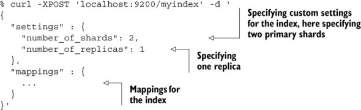
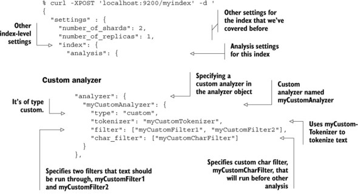
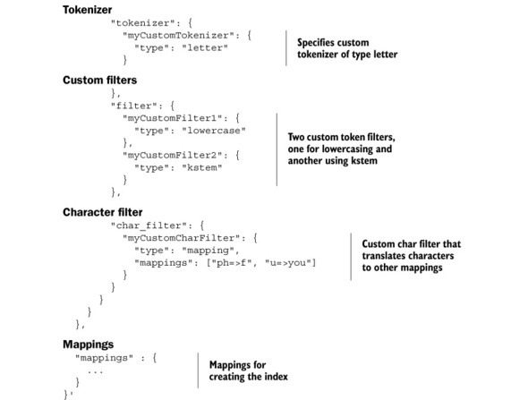

## 使用分析器

有以下两种方式指定字段所使用的分析器。
1. 当创建索引的时候，为特定的索引进行设置。
2. 在Elasticsearch的配置文件中，设置全局的分析器。


### 在索引创建时增加分析器




这里是索引创建时的一些设置，索引主分片和副分片的数量。


---

**创建索引时,通过配置settings来增加分析器。**







**analyzer、 tokenizer、 filter可以在elasticsearch.yml 配置， 下面是配置例子**

```
index :
    analysis :
        analyzer :
            standard :
                type : standard
                stopwords : [stop1, stop2]
            myAnalyzer1 :
                type : standard
                stopwords : [stop1, stop2, stop3]
                max_token_length : 500
            # configure a custom analyzer which is
            # exactly like the default standard analyzer
            myAnalyzer2 :
                tokenizer : standard
                filter : [standard, lowercase, stop]
        tokenizer :
            myTokenizer1 :
                type : standard
                max_token_length : 900
            myTokenizer2 :
                type : keyword
                buffer_size : 512
        filter :
            myTokenFilter1 :
                type : stop
                stopwords : [stop1, stop2, stop3, stop4]
            myTokenFilter2 :
                type : length
                min : 0
                max : 2000
```


### 使用分析API

```
GET /_analyze
{
  "analyzer" : "standard",
  "text":  "experence with Nosql & big data technologies"
}
```

**ik分析**

分析：拉货宝物流

词典，词语切分，歧义判断。

1、IK分词器也是基于正向匹配的分词算法。
2、IK分词器，基本可分为两种模式，一种为smart模式，一种为非smart模式
3、非smart模式所做的就是将能够分出来的词全部输出；smart模式下，IK分词器则会根据内在方法输出一个认为最合理的分词结果，这就涉及到了歧义判断
4、Lexeme 词元，compareTo(Lexeme other)这个方法决定了词元在链路中的位置
5、LexemePath词元链，分词的一种结果，根据前后顺序组成一个链式结构,其实就是由交叉的Lexeme 组成的有序集合QuickSortSet
6.Apache Lucene 5.x以后分词支持数字字母连续混合模糊搜索
歧义：
     1）比较有效文本长度      2）比较词元个数，越少越好      3）路径跨度越大越好      4）根据统计学结论，逆向切分概率高于正向切分，因此位置越靠后的优先      5）词长越平均越好
歧义分析：

拉货宝物流：

1.拉，货，宝，物，流，宝物，物流
- 拉，货，宝物，流 =13
- 拉，货，宝，物流 =14

```
GET _analyze 
{
  "analyzer": "ik_smart",
  "text": "拉货宝物流"
}
```

```
GET _analyze 
{
  "analyzer": "ik_max_word",
  "text": "拉货宝物流"
}
```

---

以上资料仅供参考，为了使用Elasticsearch，您不需要理解所有的细节。分词算法只是为了理解，以防将来需要的时候参考，具体细节可以翻阅插件源码。

---


**建一个索引和设置分析器**

```
PUT vehicle_test/
 {
 	"settings": {
        "analysis": {
          "analyzer": {
            "my_analyzer": {
              "tokenizer": "my_tokenizer"
            }
          },
          "tokenizer": {
            "my_tokenizer": {
              "token_chars": [
                "letter",
                "digit"
              ],
              "min_gram": "1",
              "type": "edgeNGram",
              "max_gram": "20"
            }
          }
        }
  },
  "mappings": {
        "_doc": {
            "properties": {
                "vehicle": {
                    "type": "text",
                    "analyzer": "my_analyzer"
                }
            }
        }
    }
}
```

```
GET vehicle_test
```


分析车牌号

```
GET vehicle_test/_analyze 
{
  "analyzer" : "my_analyzer",
  "text":  "京A12345"
}
```

分析车牌单号手机身份证模糊number_test
```
{
    "settings": {
        "analysis": {
            "analyzer": {
                "index_number_analyzer": {
                    "type": "custom",
                    "tokenizer": "standard",
                    "filter": [
                        "lowercase",
                        "name_ngram_filter",
                        "trim"
                    ]
                },
                "search_number_analyzer": {
                    "type": "custom",
                    "tokenizer": "standard",
                    "filter": [
                        "lowercase",
                        "trim"
                    ]
                }
            },
            "char_filter": {
                    "digit_only": {
                      "type": "pattern_replace",
                      "pattern": "\港独",
                      "replacement": ""
                    }
                  },
            "filter": {
                "name_ngram_filter": {
                    "type": "ngram",
                    "min_gram": "1",
                    "max_gram": "20"
                }
            }
        }
    },
    "mappings": {
        "_doc": {
            "properties": {
                "createTime": {
                    "type": "date"
                },
                "updateTime": {
                    "type": "date"
                },
                "vehicle": {
                    "type": "text",
                    "analyzer": "index_number_analyzer",
                    "search_analyzer": "search_number_analyzer"
                },
                "taskNuber": {
                    "type": "text",
                    "analyzer": "index_number_analyzer",
                    "search_analyzer": "search_number_analyzer"
                },
                "mobile": {
                    "type": "text",
                    "analyzer": "index_number_analyzer",
                    "search_analyzer": "search_number_analyzer"
                },
                "memberCardCode": {
                    "type": "text",
                    "analyzer": "index_number_analyzer",
                    "search_analyzer": "search_number_analyzer"
                }
            }
        }
    }
}

```


---

### 分析器被使用

当我们索引（index）一个文档，全文字段会被分析为单独的词来创建倒排索引。不过，当我们在全文字段搜索（search）时，我们要让查询字符串经过同样的分析流程处理，以确保这些词在索引中存在。

- 当你查询全文（full text）字段，查询将使用相同的分析器来分析查询字符串，以产生正确的词列表。
- 当你查询一个确切值（exact value）字段，查询将不分析查询字符串，但是你可以自己指定。

具体值和_all：

- date字段包含一个确切值：单独的一个词“2019-08-29”  。
- _all字段是一个全文字段，所以分析过程转为三个词：“2019”、“08”和“29”。


例：
- _all字段查询2019
- _all字段中查询2019-08-07 

```
GET /_search?q=2019   

GET /_search?q=2019-08-07
```

当我们在_all字段中查询2019-08-07 ，首先分析查询字符串，产生匹配任意词2019、08或07的查询语句，它依旧匹配上面的个结果，因为他们都包含词2019。


当我们在date字段中查询2019-08-07，它查询一个确切的日期：

```
GET /_search?q=createTime:2019-08-07
```

当我们在date字段中查询2019，没有找到文档，因为没有文档包含那个确切的日期：

```
GET /_search?q=createTime:2019  
```


### 测试分析器

尤其当你是Elasticsearch新手时，对于如何分词以及存储到索引中理解起来比较。为了更好的理解如何进行，你可以使用analyze API来查看文本是如何被分析的。在查询字符串参数中指定要使用的分析器，被分析的文本作为请求体：

```
GET _analyze 
{
  "analyzer": "standard",
  "text": "Text to analyze"
}
```

结果：

```
{
  "tokens": [
    {
      "token": "text",
      "start_offset": 0,
      "end_offset": 4,
      "type": "<ALPHANUM>",
      "position": 0
    },
    {
      "token": "to",
      "start_offset": 5,
      "end_offset": 7,
      "type": "<ALPHANUM>",
      "position": 1
    },
    {
      "token": "analyze",
      "start_offset": 8,
      "end_offset": 15,
      "type": "<ALPHANUM>",
      "position": 2
    }
  ]
}
```
       

token是一个实际被存储在索引的词。position指明词在原文本中是第几个出现的。start_offset和end_offset表示词在原文本中占据的位置。

analyze API对于理解Elasticsearch索引的内在细节是分厂有用的工具。

指定分析器

当Elasticsearch在你的文档中探测到一个新的字符串字段，它将自动设置它为全文string字段并用standard分析器分析。

你不可能总是想这么做。也许你想使用一个更适合这个数据的语言分析器。或者，你只想把字符串字段当做一个普通的字段——不做任何分析，只存储确切值，就像字符串类型的用户ID或者内部状态字段或者标签。

为了达到这种效果，我们必须通过映射（mapping）人工设置这些字段。
        


---
   
>Elasticsearch 从入门到跑路